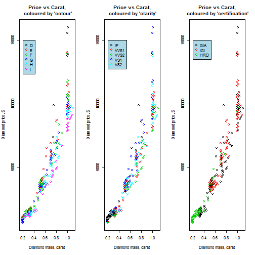
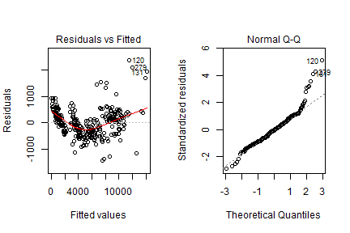
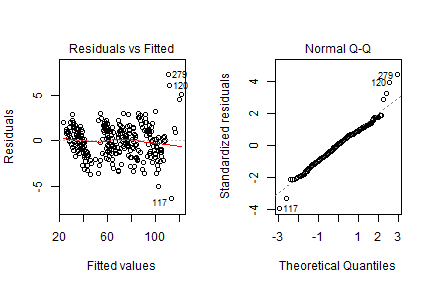
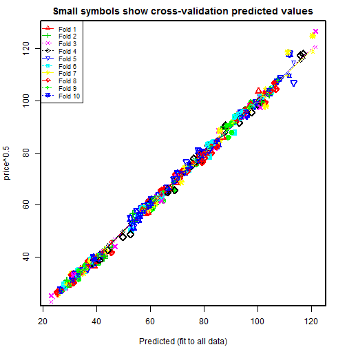

## <span style="color:blue">Dataset description</span>

- Data can be obtained from package "ECdat"
- Dataset contains 308 entries
- Each object is characterised by five variable:
  + "carat" - numeric variable equalstha mass of dimanod in carats 
  + "color" - categorical variable which can be D, E, F, G, H, I. The most uncontaminated and prized is D.
  + "clarity" - categorical variable which can be IF (internally flawless), VVS1 and VVS2 (very very slightly imperfect), VS1 and VS2 (very slightly imperfect)
  + "certification" - categorical variable. Diamonds from the dataset are certified by one of three organisation: Gemmological Institute of America (GIA), Antwerp based International Gemmological Institute (IGI), Hoge Raad Voor Diamant (HRD)
  + "price" - numeric variable which equals the price in Singapour dollar 
- The goal of this application predict diamond price based on the other four variables

--- &twocol w1:65% w2:35%

## <span style="color:blue">Exploratory analysis</span>

*** =left
 
*** =right
Main conclusions from exploratory analysis:
- Dependence of the Diamond price on its' mass is nonlinear.
- Variables colour and clarity are evidently influence on the price value.
- The influence of the Variable certification is not so evident
- Heteroscedasticity in data is observed


--- &twocol w1:40% w2:60%

## <span style="color:blue">Linear model construction and assession</span>
I used simple linear model and model with square root transformation of price value for heteroscdasticity elimination.
Q-Q plot and residuals inspection show that the latter model is better for evaluation. 

*** =left

```r
fit_simple=lm(price ~ carat+colour+clarity+ 
certification+clarity*carat+ 
colour*carat+certification*carat,
data=Diamond)
```
 


*** =right


```r
fit_sqrt=lm(price^0.5 ~ carat+clarity+
colour+certification+clarity*carat+ 
colour*carat + certification*carat,
data=Diamond)
```
 

---&twocol w1:50% w2:50%

## <span style="color:blue">Model selection and cross-validation</span> 
*** =left
Here I execute anova test on the model "fit_sqrt".

```r
anova(fit_sqrt)
```
The results mean that I'd better omit variable carat*certification from the model.
Now I am ready to produce 10-fold cross-validation on the dataset

```r
options(warn=-1)
final_fit = lm(price^0.5 ~ carat+clarity+
colour+certification+clarity*carat+
colour*carat,data=Diamond)
```
*** =right

```r
cv <- cv.lm(df=Diamond, final_fit, m=10)
```

 
 

 


